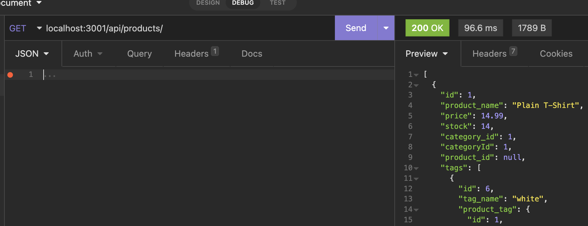

# e-commerce-back-end

Description: This is a back end application that functions as an e-commerce website. Through Insomnia, users can create, edit, and delete categories, products, and product tags. This app utilizes mysql, sequelize, and express routes

Installation: N/A

Usage: Please visit this link to view a walkthrough of the project: https://drive.google.com/file/d/1DI83XpbxLphs7F2Usxm_ve0yJtQFjK6b/view 

Credits N/A

License Please refer to the license in the repo

